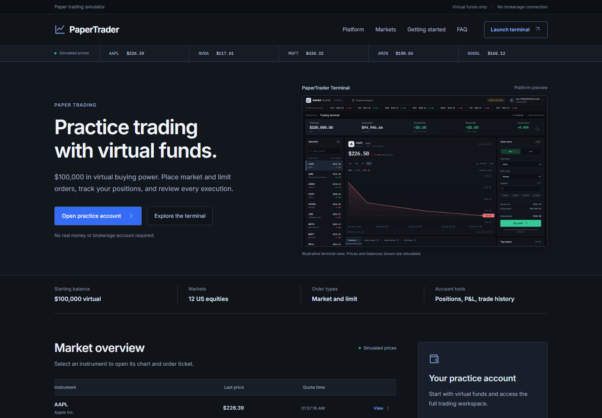

# PaperTrader

[](https://github.com/nishantshah0/paper-trader/actions/workflows/ci.yml) · [MIT license](LICENSE)

A local paper-trading simulator with a React terminal, a Spring Boot execution engine, and PostgreSQL. Practice market and limit orders with virtual cash, watch fills update across browser tabs, and track realized and unrealized P&L.

**No real money or brokerage connection.** The default feed generates simulated prices. Optional Finnhub mode uses provider quotes and refuses execution against stale prices. Practice accounts are shared and unauthenticated; this project is intended for local use.



<details>
<summary>Trading terminal</summary>


</details>

## Quick start

With Docker Desktop's engine running:

```bash
git clone https://github.com/nishantshah0/paper-trader.git
cd paper-trader
docker compose --profile app up --build -d --wait
```

Open **http://localhost:8080**. Choose **Open practice account**, enter a lowercase account name, and receive $100,000 in virtual funds. Keep the account ID to reopen it later. The terminal is at **http://localhost:8080/terminal**.

The first build downloads Java and Node dependencies. The app and database bind to loopback. Stop them while keeping account data with:

```bash
docker compose --profile app down
```

## Features

- Dark home page with current quote previews, direct account setup, and a guide to the simulator.
- Trading terminal with a searchable watchlist, chart crosshair and time ranges, order ticket, and keyboard-accessible activity tabs.
- Market and limit orders, cancellation, cash/position validation, and account-scoped idempotency keys.
- Scheduled execution and committed-order notifications over STOMP WebSockets, with reconnect resynchronization and a polling fallback.
- Portfolio value, realized/unrealized P&L, execution history, and a leaderboard ranked by return percentage.
- Durable open orders that resume after an application restart. Recent chart data holds up to 240 observed quotes per symbol; it survives browser refreshes and resets on server restart.

## Execution rules

A market order fills at the cached quote. A buy limit fills at or below its limit; a sell limit fills at or above it. Marketable limits execute immediately; the scheduler checks resting orders every second.

Fills are whole-order, whole-share, and long-only. Open orders do **not** reserve cash or shares. Placement checks resources, and execution checks again. A resting order that becomes unfunded is marked `REJECTED` without a trade or balance change.

The account row lock serializes placement, matching, and cancellation. Cash, positions, order status, and the trade row commit together. Postgres is the order book; a unique constraint prevents duplicate fills. Reusing an `Idempotency-Key` with the same account and payload returns the original order; a changed payload returns 409.

This is a quote-triggered simulator. It does not model user-to-user exchange matching, partial fills, slippage, commissions, shorting, or liquidity. See [architecture and tradeoffs](docs/architecture.md).

## Quote modes

| Mode             | Behavior                                                             |
| ---------------- | -------------------------------------------------------------------- |
| `demo` (default) | Simulated price updates every 15 seconds, clearly labeled in the UI. |
| `static`         | Configured prices remain unchanged for deterministic experiments.    |
| `finnhub`        | Server-side provider quotes. Requires your own API key.              |

For Finnhub, copy `.env.example` to `.env` and set:

```dotenv
FEED_MODE=finnhub
FINNHUB_API_KEY=your_key
FEED_INTERVAL_MS=15000
```

Recreate the app with the Quick start Compose command. Keys remain server-side. The adapter calls [Finnhub's quote endpoint](https://finnhub.io/docs/api/quote); twelve symbols at the default interval use up to 48 requests per minute. Set the interval to fit your provider plan.

Live mode never executes against seed prices. Provider timestamps must be within the last 120 seconds. Errors retain the last quote, but stale prices cannot execute orders, including outside market hours. Automated tests do not contact Finnhub.

## Development

Use **JDK 21**, **Node 22**, npm, and Docker. Maven is supplied by the wrapper; `.nvmrc` records the Node version.

```bash
# Backend: Spring Boot starts the Compose database.
./mvnw spring-boot:run

# Frontend, in another terminal:
cd frontend
npm ci
npm run dev
```

On Windows, use `.\mvnw.cmd` instead of `./mvnw`. Open Vite's displayed URL; it proxies REST and WebSocket traffic to port 8080. Stop the packaged app container before starting the backend locally.

## Verification

```bash
./mvnw verify
cd frontend
npm ci
npm run format:check
npm run build
npx playwright install chromium
npm test
```

Backend tests use real Postgres through Testcontainers. Browser tests require the complete app at `http://127.0.0.1:8080`; set `E2E_BASE_URL` for another local instance. They create synthetic accounts, so use a disposable database when a clean practice environment matters.

Coverage includes scheduled limit fills, double-spend and fill/cancel races, idempotent retries, stale quotes, migrations, P&L, home/terminal navigation, account persistence, responsive layouts, and two-tab WebSocket delivery. CI runs on pull requests and main, and cancels obsolete runs on the same ref.

## API

All bodies are JSON. Errors use RFC 9457 problem details. Cash uses decimal cents; prices and average costs use four decimal places. Values are USD.

| Method | Path                                    | Purpose                                  |
| ------ | --------------------------------------- | ---------------------------------------- |
| POST   | `/api/accounts`                         | Create a practice account                |
| GET    | `/api/accounts/{id}`                    | Cash and starting balance                |
| GET    | `/api/accounts/{id}/portfolio`          | Positions, value, and P&L                |
| POST   | `/api/accounts/{id}/orders`             | Place an order; optional Idempotency-Key |
| GET    | `/api/accounts/{id}/orders?status=OPEN` | Orders; status is optional               |
| GET    | `/api/accounts/{id}/orders/{orderId}`   | One order                                |
| DELETE | `/api/accounts/{id}/orders/{orderId}`   | Cancel an open order                     |
| GET    | `/api/accounts/{id}/trades`             | Fills, newest first                      |
| GET    | `/api/quotes`, `/api/quotes/{symbol}`   | Cached quotes and timestamps             |
| GET    | `/api/quotes/status`                    | Feed mode                                |
| GET    | `/api/quotes/history`                   | Up to 240 observed quotes per symbol     |
| GET    | `/api/leaderboard`                      | Top 20 by return percentage              |
| GET    | `/actuator/health`                      | Health check                             |

Example limit-order body:

```json
{
    "symbol": "AAPL",
    "side": "BUY",
    "type": "LIMIT",
    "quantity": 2,
    "limitPrice": 225.5
}
```

STOMP endpoint: `/ws`. Subscribe to `/topic/quotes` and `/topic/accounts/{id}`. Account events trigger portfolio/order/trade refreshes after commit. Browser clients cannot publish broker messages.

## Limitations

There is no authentication or account-level authorization. Account IDs are not passwords. Add an identity and authorization layer before public deployment. Corporate actions, exchange calendars, persistent historical prices, and distributed messaging are outside this demo. The leaderboard scans accounts, and order lists are unpaginated; this is designed for a small local practice environment.

## Contributing

See [CONTRIBUTING.md](CONTRIBUTING.md) for setup, checks, and change guidelines. Use the repository's issue forms for reproducible bugs and focused feature requests.

## License

[MIT](LICENSE)
