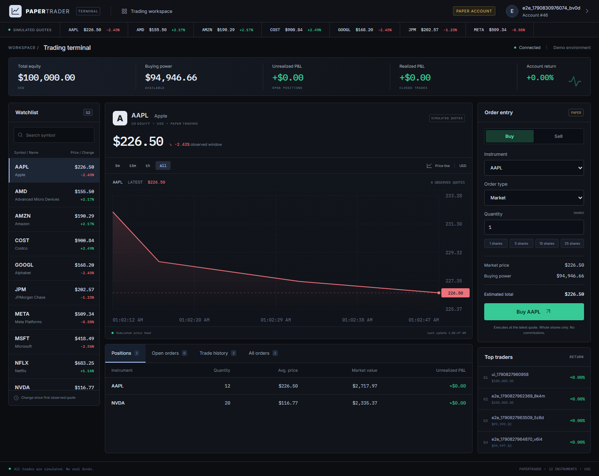

# paper-trader

A local paper-trading desk built with Java 21, Spring Boot, Postgres, and React. Place market and limit orders, watch fills arrive in two browser tabs, and track realized and unrealized P&L.

**Simulation only.** No brokerage connection, no real funds, and no real orders. The default feed uses simulated prices. Optional Finnhub mode uses provider quotes and rejects execution against stale prices.



## Run the complete app

Install Docker Desktop, start its engine, then run:

```bash
git clone https://github.com/nishantshah0/paper-trader.git
cd paper-trader
docker compose --profile app up --build -d --wait
```

Open **http://localhost:8080**. Create a lowercase account name to receive $100,000 in synthetic cash. Keep the account ID to reopen it in another browser. The first image build downloads Java and Node dependencies and can take several minutes.

The terminal has a searchable watchlist, chart crosshair and time ranges, quantity shortcuts, and keyboard-accessible activity tabs. Recent chart samples survive browser refreshes; the server keeps up to 240 observed quotes per symbol in memory and clears them on application restart. No historical prices are fabricated.

The dashboard includes a watchlist, interactive price chart with recent observed history, order ticket, positions, open orders and cancellation, trade history, and a leaderboard ranked by percentage return. Prices update every 15 seconds in demo mode; the matcher checks open orders every second.

```bash
# Stop the app and database; keep account data in the named volume.
docker compose --profile app down
```

This is a **shared local demo without authentication**. Anyone with access can view and trade on any account ID. Compose binds both ports to loopback. Add authentication and authorization before exposing it publicly.

## Order behavior

- Market orders execute immediately at the cached quote.
- Buy limits fill when the quote is at or below the limit; sell limits fill at or above it. A marketable limit executes immediately.
- Fills are whole-order, whole-share, long-only, with no slippage, commissions, or liquidity modeling. This is a quote-triggered simulator, not an exchange matching buyers against sellers.
- Open orders **do not reserve cash or shares**. Placement checks resources, then execution checks again. A resting order that becomes unfunded is marked `REJECTED`, without a trade or balance change.
- The account row lock serializes placement, matching, and cancellation. Cash, positions, orders, and trades commit together. A unique constraint allows only one fill per order.
- An optional `Idempotency-Key` header makes retries safe. Same account + key + payload returns the original order; a different payload returns 409. The dashboard retains its key when a request fails so a retry cannot duplicate an uncertain fill.
- Postgres is the durable order book. The matcher reloads open orders in creation/ID order each tick, so restart recovery needs no separate cache rebuild.

See [architecture and tradeoffs](docs/architecture.md).

## Optional provider quotes

Copy `.env.example` to `.env` and set:

```dotenv
FEED_MODE=finnhub
FINNHUB_API_KEY=your_key
FEED_INTERVAL_MS=15000
```

Recreate the app with the same Compose command. The key stays on the server and is not included in browser code or logs. The quote adapter calls [Finnhub's quote endpoint](https://finnhub.io/docs/api/quote). Twelve symbols at the default interval use up to 48 requests per minute; choose an interval appropriate for your provider plan.

Live mode never executes at seed prices. A quote must have a provider timestamp within the last 120 seconds. Provider errors retain the previous quote; stale quotes remain visible but cannot execute orders. This deliberately means trading can be unavailable outside market hours. `FEED_MODE=static` keeps seed prices unchanged for deterministic manual experiments.

Live provider access requires your own key; automated tests use local quotes and do not contact Finnhub.

## Development

Requirements: JDK 21, Docker, Node 22, and npm. Maven is included through the wrapper.

```bash
# Backend; Spring Boot starts the Compose database automatically.
./mvnw spring-boot:run

# In another terminal; Vite proxies REST and WebSocket requests to port 8080.
cd frontend
npm ci
npm run dev
```

On Windows use `.\mvnw.cmd` instead of `./mvnw`. Open Vite's displayed URL for frontend development. Stop a packaged app container before starting the backend locally so both do not claim port 8080.

## Verification

```bash
./mvnw verify                       # Unit + real Postgres integration tests
cd frontend
npm ci
npm run format:check
npm run build
npx playwright install chromium
npm test                           # Requires the complete app on localhost:8080
```

Set `E2E_BASE_URL` to test another local instance. Browser tests create their own synthetic accounts; use a disposable database when a clean leaderboard matters.

Tests cover market execution, limit crossings, scheduled fills, cancellation, rejected orders, concurrent spending, duplicate retries, fill/cancel races, stale quotes, schema migrations, P&L, and two-tab WebSocket delivery. Browser checks include desktop and mobile layouts. GitHub Actions runs the backend suite, builds the complete Docker app, and runs the browser suite.

## API

Bodies are JSON; errors use RFC 9457 problem details. All values are USD. Cash uses decimal cents; prices and average costs use four decimal places.

| Method | Path | Purpose |
| --- | --- | --- |
| POST | `/api/accounts` | Create a practice account |
| GET | `/api/accounts/{id}` | Cash and starting balance |
| GET | `/api/accounts/{id}/portfolio` | Positions, value, and P&L |
| POST | `/api/accounts/{id}/orders` | Place a market or limit order; optional Idempotency-Key |
| GET | `/api/accounts/{id}/orders?status=OPEN` | List orders; status is optional |
| GET | `/api/accounts/{id}/orders/{orderId}` | One order |
| DELETE | `/api/accounts/{id}/orders/{orderId}` | Cancel an open order |
| GET | `/api/accounts/{id}/trades` | Fills, newest first |
| GET | `/api/quotes`, `/api/quotes/{symbol}` | Cached quotes and timestamps |
| GET | `/api/quotes/status` | Feed mode |
| GET | `/api/quotes/history` | Up to 240 observed quotes per symbol |
| GET | `/api/leaderboard` | Top 20 by return percentage |
| GET | `/actuator/health` | Health check |

Example limit-order body:

```json
{"symbol":"AAPL","side":"BUY","type":"LIMIT","quantity":2,"limitPrice":225.50}
```

STOMP endpoint: `/ws`. Subscribe to `/topic/quotes` and `/topic/accounts/{id}`. Account messages invalidate portfolio/order/trade views after commit. Clients can subscribe but cannot publish broker messages. The dashboard resynchronizes on reconnect and uses a 15-second polling fallback.

## Scope

The original four-stage roadmap is implemented: core REST domain, scheduled limit execution and price feeds, real-time React dashboard, and packaging/CI/idempotency. Two design choices differ from the initial sketch: a durable database book replaces the in-memory book, and the existing pessimistic account lock is retained instead of adding optimistic locking.

Intentionally outside this demo: authentication, partial fills, shorting, order reservations, exchange calendars, corporate actions, persistent historical chart storage, and distributed broker deployment. The leaderboard scans accounts and order lists are unpaginated; this implementation targets a small local practice environment.

## License

[MIT](LICENSE)
